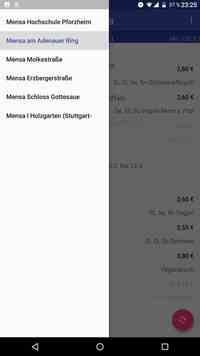
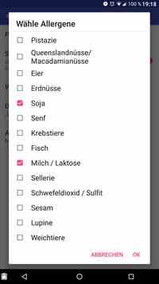

MensaPlan
=========

Features
--------







Build
-----

```bash
$ gradlew assembleDebug
```

Card-Reading-Details
--------------------

can be found in the [KitCardReader](https://github.com/pkern/kitcard-reader)
