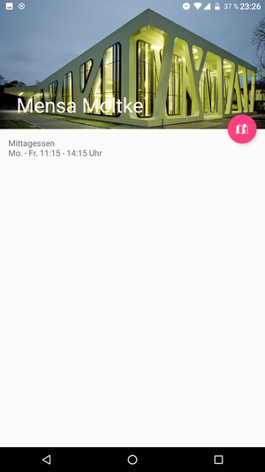
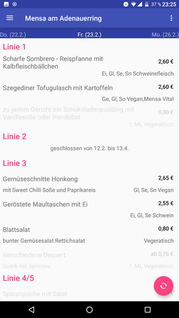
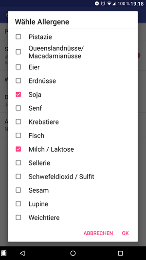

MensaPlan
=========

[
	
](https://circleci.com/gh/csicar/MensaPlan)

Features
--------








Build
-----

```bash
$ gradlew assembleDebug
```

apk can be found in `app/build/outputs/apk/debug/`

Card-Reading-Details
--------------------

can be found in the [KitCardReader](https://github.com/pkern/kitcard-reader)
